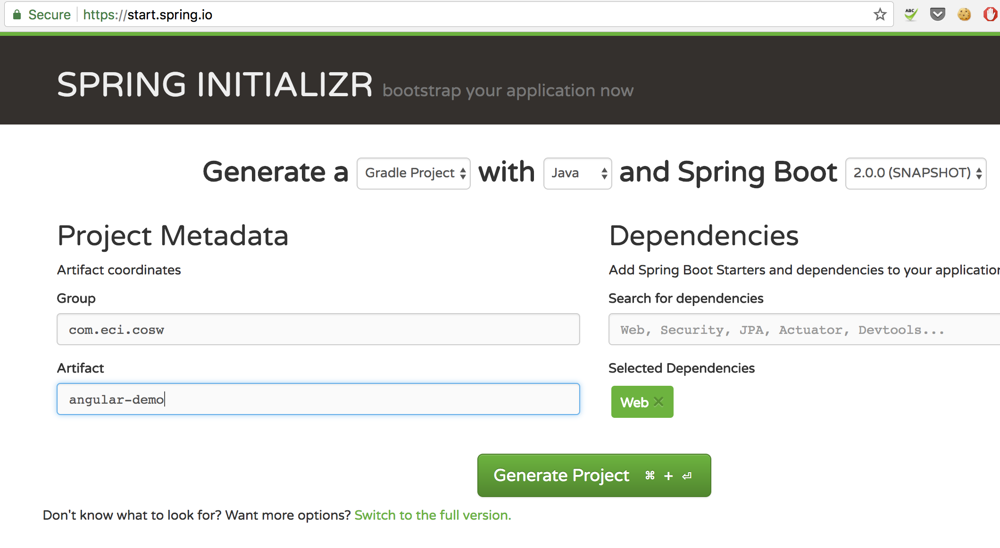

# Spring Boot - AngularJS Intro

Introduction to Angular JS and Spring Boot.


1) Create a Spring Boot Project at [Spring Intializer](https://start.spring.io) webstite with the following configuration: 
 
 
 
2) Clone this repository, open the console and  go to *angular-seed* folder
 
3) Install the node libraries with the following command:

    ```
    npm install
    ```
4) Run the angular local server to test the base project and make sure the navigation works correctly:
    
    ```
    npm start
    ```

5) Create a folder called models. And then create a model class for the TODO object.
    
    5.1) Navigate to the models folder and generate the TODO class with the following command:
    
    ```
    ng g class todo
    ```
    5.2) Add the following attributes to the TODO model:
            
   ```
        export class Todo {
            private description: string;
            private priority: Number;
            private completed: boolean;
        
            constructor(description: string, priority: Number = 1, completed: boolean = false) {
                this.description = description;
                this.completed = completed;
                this.priority = priority;
            }
        }
  
   ```
6) Read about services in the Angular JS documentation site: https://angular.io/guide/architecture#services. 
Once you understand the concept of services then create a service that will handle the TODO objects: 

    6.1) Create a folder called services.
    
    6.2) Navigate from the console to the services folder and generate the TODO service with the following command.
    
    ``` 
    ng g service todo --spec false
    ```
            
    6.3) Open the file *todo.service.ts* and check the content of the generated file.
      

7) Create a mocked list of TODO objects in the *todo.service.ts* file:

    ``` 
    @Injectable()
    export class TodoService {
      private todos: Todo[] = [
          new Todo('todo 1'),
          new Todo('todo 2', 1, true),
          new Todo('todo 3')
        ];
    
    ```

8) Create a method that expose the mocked list of TODO objects:
     
    ``` 
        constructor() {
        
          }
        
          list(): Todo[] {
            return this.todos;
          }      
     ```
     

9) Register the *todo.service* as provided in the *app.module.ts* file:

    9.1) Import the service:

      ``` 
      import { TodoService } from './services/todo.service';

      ```
    9.2) Include the *todo.service* in the providers array of the app module:
      ``` 
     @NgModule({
       declarations: [
         AppComponent,
         HomePageComponent,
         TaskListPageComponent,
         TaskEditPageComponent,
         PageNotFoundComponent
       ],
       imports: [
         BrowserModule,
         NgbModule.forRoot(),
         RouterModule.forRoot(ROUTES)
       ],
       providers: [TodoService],
       bootstrap: [AppComponent]
     })
     export class AppModule { }
    
      ```

10) Import and inject the *todo.service* in the *task-list-page.components.ts*:

    10.1) Import the *TodoService* and the model:

    ``` 
    import { TodoService } from '../../services/todo.service';
    import { Todo } from '../../models/todo';             
    ```  
          
    10.1) Inject the *TodoService* in the component constructor:
          
      ``` 
       constructor(public todoService: TodoService) {
                
                  }
       ```   
11) Create a list of Todo Objects in the *TaskListPageComponent*:
     
     ``` 
    export class TaskListPageComponent implements OnInit {
      private todos: Todo[] = [];
      ``` 
            
12) Implement the *ngOnInit* method to initialize the Todo Objects list:
       
     ``` 
     ngOnInit() {
         this.todos = this.todoService.list();
       }
      ``` 
13) Go to the view *tasks-list-page.component.html* and add the logic to display the list:      
      
      ``` 
     <h2>Tasks</h2>
     <table class="table table-bordered">
       <thead>
         <tr>
           <th>Description</th>
           <th>Priority</th>
           <th>Completed</th>
         </tr>
       </thead>
       <tr *ngFor="let todo of todos">
         <td>{{todo.description}}</td>
         <td>{{todo.priority}}</td>
         <td>{{todo.completed}}</td>
       </tr>
     </table>
      ``` 
14) Start the Angular server and verify that the lists of TODOs is shown correctly.

15) Inject the Todo service in the *TaskEditPageComponent*.
 
16) Create a form on the view *task-edit-page-component.html* to create a TODO object:
     ``` 
     <div class="container">
       <h2>Edit Task</h2>
       <form [formGroup]="todoForm" (ngSubmit)="onSubmit()" novalidate>
         <div class="form-group">
           <label for="description">Description</label>
           <input type="text" class="form-control" id="description" formControlName="description" required>
         </div>
     
         <div class="form-group">
           <label for="priority">Priority</label>
           <input type="number" class="form-control" id="alterEgo" formControlName="priority">
         </div>
     
         <div class="form-group">
           <label for="completed">Completed</label>
           <input type="checkbox" class="form-control" id="completed" formControlName="completed">
         </div>
     
         <button type="submit" class="btn btn-success">Save</button>
     
       </form>
     </div>
    ``` 

17) Import the fromGroup class and formBuilder service on the *task-edit-page.component.ts*:
    
    ```  
    import { FormGroup, FormBuilder } from '@angular/forms';
    ``` 
    
18) Initialize the form on the *task-edit-page.component.ts* ngOnInit method:

    ```  
    ngOnInit() {
        this.todoForm = this.formBuilder.group({
          description: '',
          completed: '',
          priority: ''
        });
      }
    ``` 

19) Inject the router service on the *task-edit-page.component.ts*:
    
    ```  
    import { Router } from '@angular/router';
    ...
    constructor(
        public todoService: TodoService,
        public formBuilder: FormBuilder,
        public router: Router,
      ) {
    
      }
    ```

19) Implement the method onSubmit on the *task-edit-page.component.ts*:

     ```  
    onSubmit() {
        this.todoService.create(
          this.todoForm.get('description').value,
          this.todoForm.get('priority').value,
          Boolean(this.todoForm.get('completed').value)
        );
    
        this.router.navigate(['/tasks']);
      }
    ``` 

20) Run the Angular server and verify that the add todo works.


#### Part 2: Compile the angular project and include it on the Spring Boot server

1) Compile the Angular project with the following command:
    
    ```
    npm run build
    ```
 
2) Copy all the files contain in the *anuglar-seed/dist* folder of the *resources/static* folder in the SpringBoot project.

3) Run the Spring Boot server from the console with *./gradlew bootRun* and verify that project works.


